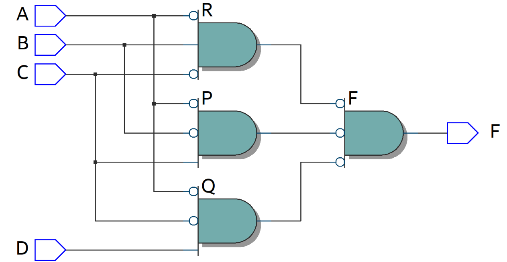
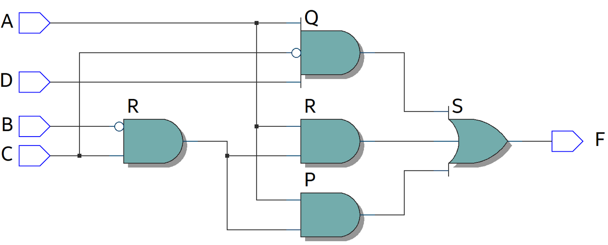

# Experiment--02-Implementation-of-combinational-logic
Implementation of combinational logic gates
 
## AIM:
To implement the given logic function verify its operation in Quartus using Verilog programming.
 F1= A’B’C’D’+AC’D’+B’CD’+A’BCD+BC’D
F2=xy’z+x’y’z+w’xy+wx’y+wxy
 
 
 
## Equipments Required:
### Hardware – PCs, Cyclone II , USB flasher
### Software – Quartus prime


## Theory
 Logic gates are electronic circuits which perform logical functions on one or more inputs to produce one output.

## Procedure
### Step 1: Create a project with required entities.

### Step 2: Create a module along with respective file name.

### Step 3: Run the respective programs for the given boolean equations.

### Step 4: Run the module and get the respective RTL outputs.

### Step 5: Create university program(VWF) for getting timing diagram.

### Step 6: Give the respective inputs for timing diagram and obtain the results.
## Program:
Program to implement the given logic function and to verify its operations in quartus using Verilog programming.
### Developed by: Sarankumar J
### RegisterNumber:  212221230087
### NAND OPERATION :-
~~~
module fourexp(A,B,C,D,F);
input A,B,C,D;
output F;
wire P,Q,R;
assign P = C&(~B)&(~A);
assign Q = D&(~C)&(~A);
assign R = (~C)&B&(~A);
assign F = (~P&~Q&~R);
endmodule
~~~
### NOR OPERATION :-
```
module fourexp(A,B,C,D,F);
input A,B,C,D;
output F;
wire P,Q,R,S;
assign P = C&(~B)&A;
assign Q = D&(~C)&A;
assign R = C&(~B)&A;
assign S = ~(P|Q|R);
assign F = ~S;
endmodule
```
## Output:-
## RTL
### NAND OPERATION

### NOR OPERATION

## Timing Diagram:-
### NAND OPERATION

### NOR OPERATION

## Result:
Thus the given logic functions are implemented using  and their operations are verified using Verilog programming.
